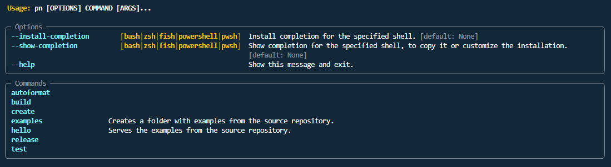
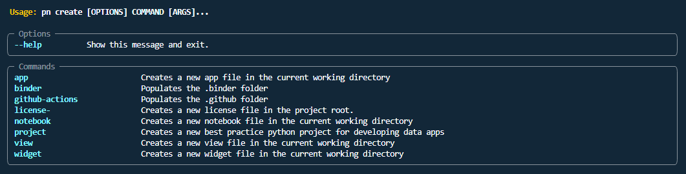
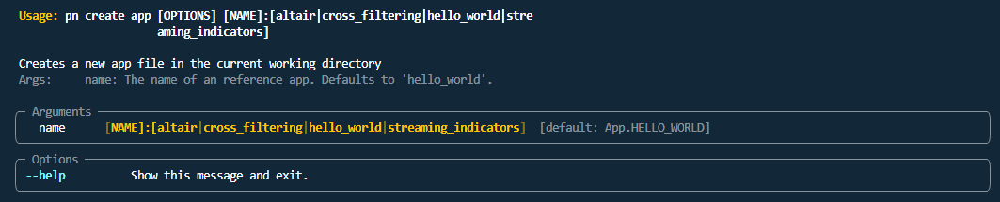

 [](https://opensource.org/licenses/Apache-2.0) [](https://twitter.com/MarcSkovMadsen)

# 🚪 Awesome Panel CLI Intro

THIS PROJECT IS IN AN ALPHA STATE AND WILL CHANGE. USE IT AT YOUR OWN RISK.

The aim of the `awesome-panel-cli` project is to **turn you into a
rockstar developer of high quality data apps.**

To do this the `awesome-panel-cli` provides an opinionated command line interface (CLI) `pn` and a
set of *best practice* templates.

For example you can install and create a new *app* as simple as

```bash
pip install awesome-panel-cli[all]
pn create app
```


This project draws inspiration from other CLI tools like

- [Angular CLI](https://angular.io/cli).
- [Django management commands](https://www.djangoproject.com/)
- [django-simple-deploy](https://github.com/ehmatthes/django-simple-deploy)
- [React Create App](https://reactjs.org/docs/create-a-new-react-app.html)

This project is a part of the [awesome-panel](https://awesome-panel.org) project. Please support the
[awesome-panel](https://awesome-panel.org) project by giving it a ⭐ at
[awesome-panel/awesome-panel](https://github.com/awesome-panel/awesome-panel).

Thanks

## Contributing

If you are looking to contribute you can find ideas in the [issue tracker](https://github.com/awesome-panel/awesome-panel-cli/issues).

I would ❤️ to support and receive your contributions. Thanks.

[](https://github.com/awesome-panel/awesome-panel-cli/issues).

## 🧳 Prerequisites

- A working [Python](https://www.python.org/downloads/) environment.
- [Git CLI](https://git-scm.com/book/en/v2/Getting-Started-Installing-Git).

## 📙 How to

Below we describe how to get started.

### 🚀 Install for usage

You can install the package via

```bash
pip install awesome-panel-cli
```

If you additionally want to serve the *intro* notebook or *example* apps you should run

```bash
pip install awesome-panel-cli[all]
```

You will then have access to a powerful command line interface invoked using the command `pn`.

### How to figure out which commands are available

Try running

```bash
pn --help
```



```bash
pn hello --help
```


```bash
pn create --help
```



```bash
pn create app --help
```



```bash
pn create project --help
```


### 💻 Install for Development

To install for development you will need a fresh and activated virtual environment.

Then run

```bash
git clone https://github.com/awesome-panel/awesome-panel-cli.git
cd awesome-panel-cli
pip install pip -U
pip install -e .[all]
```

Then you can see the available commands via

```bash
pn --help
```

You can run all tests via

```bash
pn test all
```

Please run this command before you `git push` and fix any failing tests.

### 🔥 Install the current `master` branch

If you want to try out or test the newest features you can install the current `master` branch via

```bash
pip install pip -U
pip install git+https://github.com/awesome-panel/awesome-panel-cli.git
```
